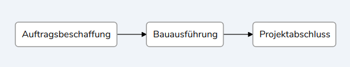

# vue-flowy

[](https://www.npmjs.com/package/vue-flowy) [](https://www.npmjs.com/package/vue-flowy) [](https://www.npmjs.com/package/vue-flowy)

<!--[](https://travis-ci.org/patcher56/vue-flowy)
[](https://codecov.io/gh/patcher56/vue-flowy)-->

[](http://opensource.org/licenses/MIT)

:warning: **WARNING: this package is deprecated! Please use the [Dagre D3](https://github.com/dagrejs/dagre-d3/wiki) renderer directly, as this is/was just a wrapper (badly bundled). See the example folder for usage in Vue.**

Smart flowchart creation based on [Vue](https://vuejs.org/) and [Dagre](https://github.com/dagrejs/dagre).

Works with Vue 2.\*

## Installation

### Install via NPM

```sh
$ npm install vue-flowy --save
```

### Install via yarn

```sh
$ yarn add vue-flowy
```

#### Register as Component

```js
import { VueFlowy } from "vue-flowy";

export default {
  name: "App",

  components: {
    VueFlowy,
  },
};
```

#### Register as plugin

```js
import Vue from "vue";
import { VueFlowy } from "vue-flowy";

Vue.component(VueFlowy);
```

## Usage



### Quick example

See a demo on [CodeSandbox](https://codesandbox.io/embed/vue-flowy-example-pvtlj)

```vue
<template>
  <VueFlowy :chart="chart"></VueFlowy>
</template>

<script>
import { VueFlowy, FlowChart } from "vue-flowy";

export default {
  name: "App",

  components: {
    VueFlowy,
  },

  data: () => ({
    chart: new FlowChart(),
  }),
  mounted() {
    const idea = this.chart.addElement("idea");
    const A = this.chart.addElement("A", { label: "vscode" });
    const B = this.chart.addElement("B", { label: "github" });
    const C = this.chart.addElement("C", { label: "npm" });
    idea.leadsTo(A).leadsTo(B);
    A.leadsTo(C);

    A.on("click", function () {
      console.log("click!");
    });
  },
};
</script>
```

## Props

| Props | Description                        | Required | Type      | Default |
| ----- | ---------------------------------- | -------- | --------- | ------- |
| chart | The Chart data (type of FlowChart) | true     | FlowChart | -       |

## API

Every FlowChart starts by creating a new **FlowChart** instance with the `FlowChart` class:

### FlowChart

```vue
data() { return { chart: new FlowChart() } }
```

The creation currently allows the following options: |option|Description|Type|Default| |------|-----------|----|-------| |direction|The direction in which the chart is built. Can be LR, TB, BT, RL|string|LR|

Now you can work with the new chart variable

#### \<FlowChart>.addElement(id, [options])

Used to add nodes to the chart. Every node needs an id, so this field is required. **returns** class FlowElement

Available options are:

| option | Description                        | Type   | Default |
| ------ | ---------------------------------- | ------ | ------- |
| label  | A label which shows up on the node | string | id      |

### FlowElement

A FlowElement is returned by \<FlowChart>.addElement. It represents one node

#### \<FlowElement>.leadsTo(\<FlowElement>, [options])

Used to connect two elements with an edge.

Available options are:

| option | Description                        | Type   | Default |
| ------ | ---------------------------------- | ------ | ------- |
| label  | A label which shows up on the edge | string | ''      |

#### \<FlowElement>.on(event, callback)

Used to add events to FlowElements. Can be any event.

## License

Vue-Flowy is open-sourced software licensed under the [MIT license](http://opensource.org/licenses/MIT)

## Contributing

As my time is limited, I would be happy if someone contributes to this project. Simply clone the repo and start developing. At the end run `yarn build` to build the package to test it.

Then link the package using `yarn link` As vue is a peer dependency, I also had to link vue for development and testing:

```sh
cd node_modules/vue
yarn link
cd ../../
```

Now go into the example directory and use the links there

```sh
cd example
yarn link "vue-flowy"
yarn link "vue"
```

Now run the app to test it out

```sh
yarn serve
```

## Support

Hello, I'm Patrick the maintainer of this project in my free time (which is getting lessen these days), if this project does help you in any way please consider to support me with pull requests. Thanks :smiley:
